# NeWork: Социальная сеть для общения и событий

NeWork — мобильное приложение для Android, представляющее собой социальную сеть с возможностью публикации постов, создания событий, упоминаниями пользователей и интеграцией карт Yandex для геолокации. Проект разработан в рамках дипломной работы.

## Описание
NeWork позволяет пользователям:

- Регистрироваться и авторизовываться.
- Просматривать ленту постов и событий.
- Создавать посты с текстом, ссылками, вложениями (фото/видео) и геолокацией.
- Упоминать пользователей (@mentions) с множественным выбором.
- Создавать события с датой, типом (онлайн/оффлайн) и локацией на карте.
- Лайкать, комментировать и делиться контентом.
- Просматривать профили пользователей и списки событий/постов.

Проект фокусируется на чистой архитектуре, работе с API (Retrofit), базой данных (Room) и интеграцией внешних сервисов (Yandex Maps).

## Технологический стек

- Язык: Kotlin (с coroutines для асинхронности).
- Архитектура: MVVM
- Навигация: Navigation Component с BottomNavigationView.
- Сеть: Retrofit2 + OkHttp для API запросов.
- База данных: Room (с DAO для постов, событий, пользователей).
- Карты: Yandex MapKit для геолокации и меток.
- Изображения/медиа: Glide для загрузки аватарок/вложений.
- UI: Material Design 3 (с темами DayNight), ConstraintLayout, RecyclerView.
- Инъекции: Hilt (Dagger) для DI.
- Другое: LiveData/StateFlow для реактивности, Flow для асинхронных данных.

# Скриншоты

| Главный экран (Посты) | Главный экран (События) | Главный экран (Пользователи) |
|-----------------------|-------------------------|------------------------------|
| [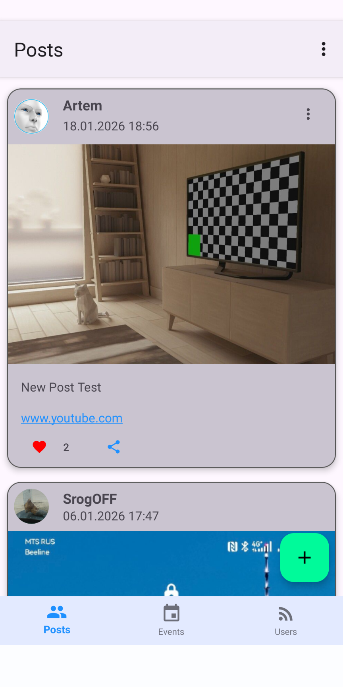](screenshots/Posts.png) | [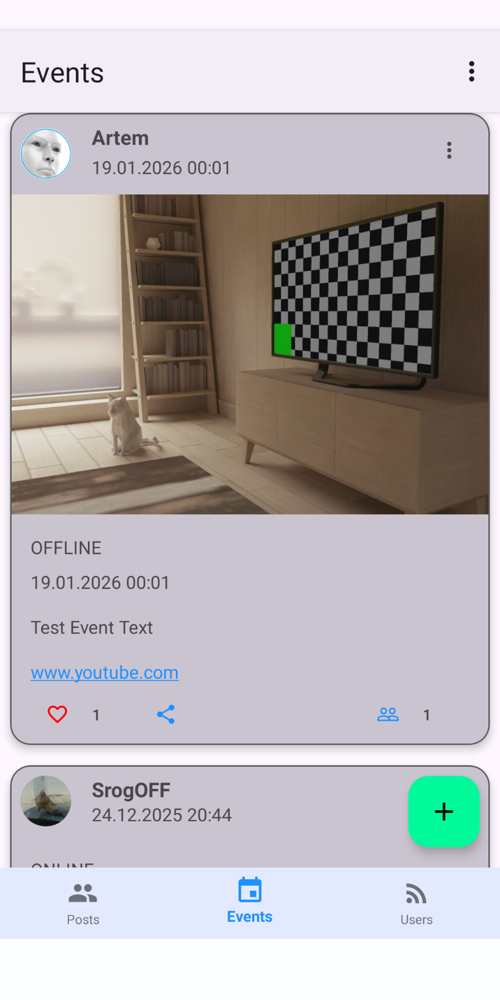](screenshots/Events.png) | [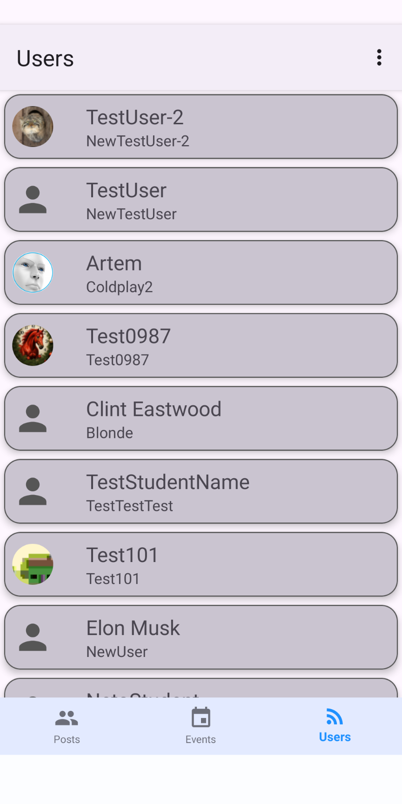](screenshots/Users.png)

| Пост | Событие | Выбор пользователей |
|------|---------|---------------------|
| [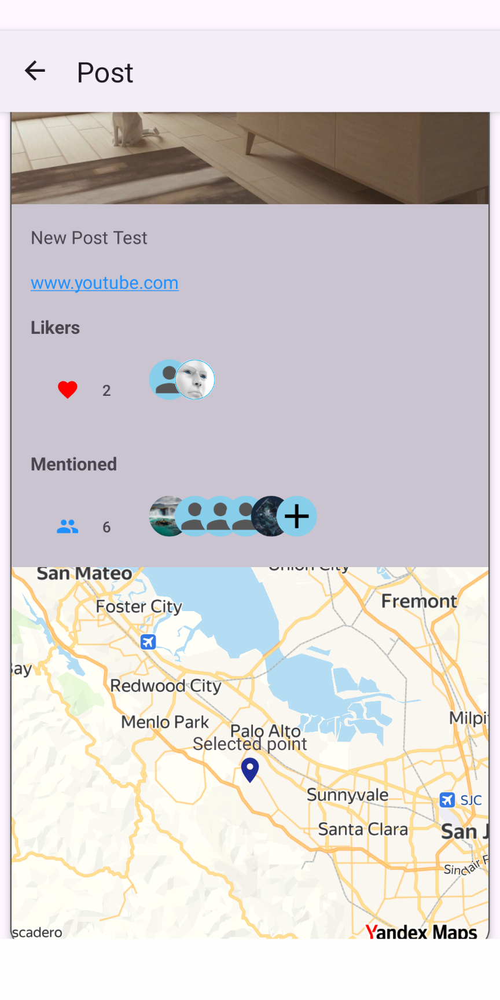](screenshots/SinglePost.png) | [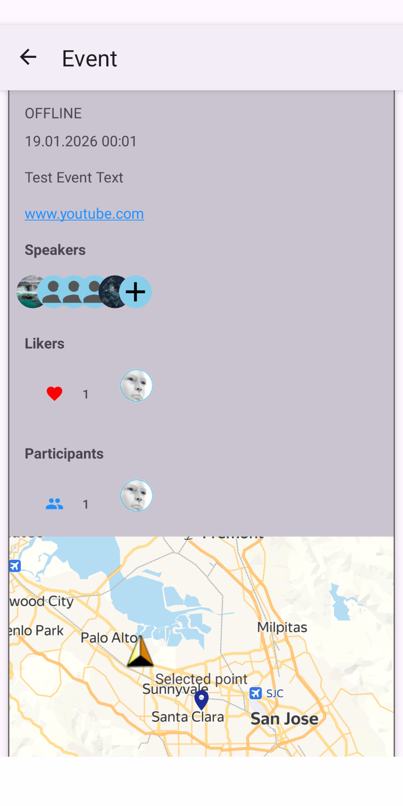](screenshots/SingleEvent.png) | [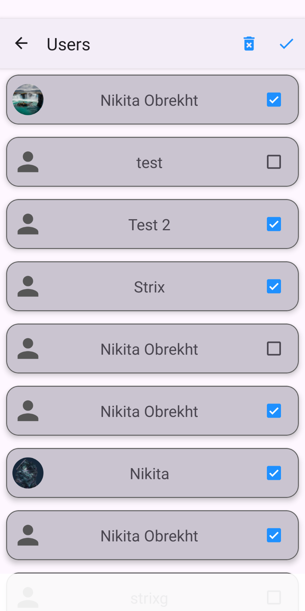](screenshots/CheckUsers.png) |

| Создание поста | Создание события | Крата |
|----------------|------------------|-------|
| [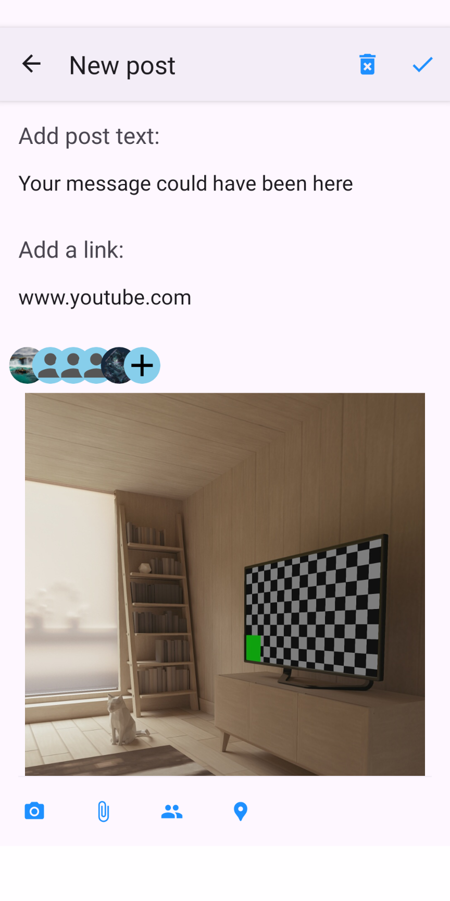](screenshots/NewPost.png) | [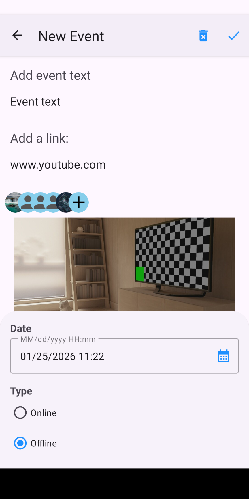](screenshots/NewEvent.png) | [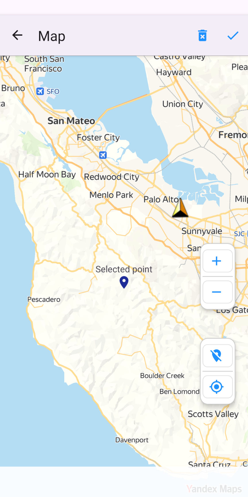](screenshots/Map.png) |

| Логин | Регистрация |
|-------|-------------|
| [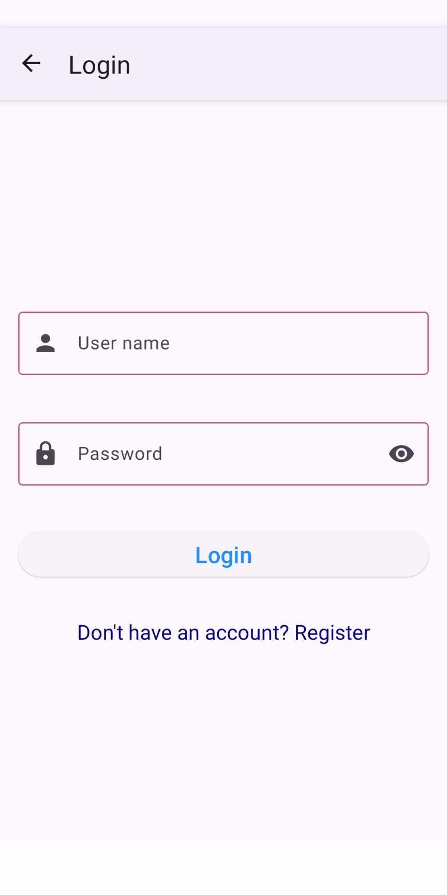](screenshots/login.png) | [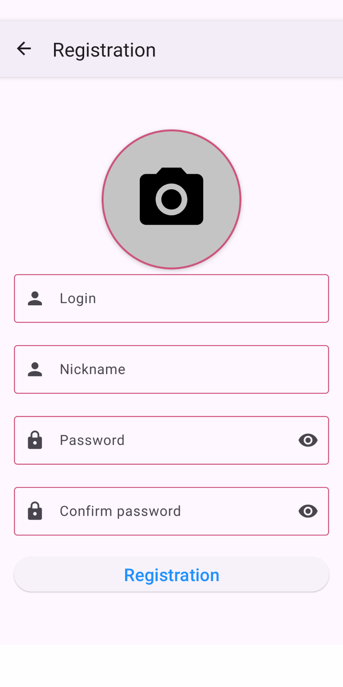](screenshots/Registration.png) |